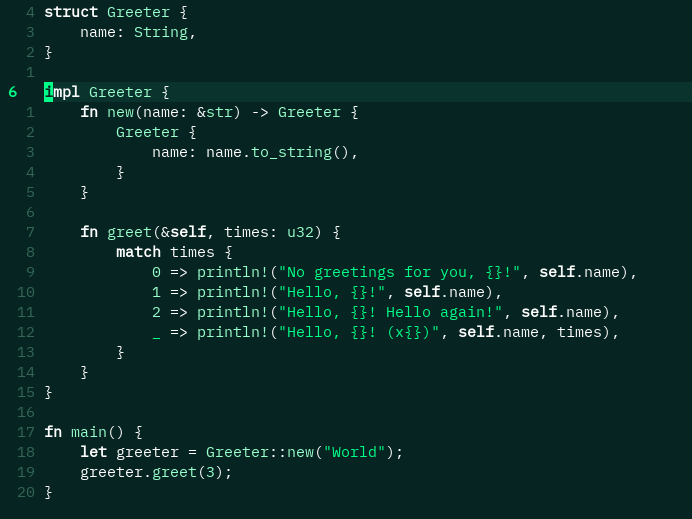

# minimalgreen

A sleek, low-contrast green theme for Neovim—designed for clarity and minimal distraction. Perfect for long coding sessions and those who love a calm, earthy palette.

---

## Features

- **High-contrast green palette** for reduced eye strain and clarity
- **Full support for Treesitter, LSP, and popular plugins**
- **Simple, readable syntax highlighting**
- **Lightweight Lua implementation**
- **Easy installation and configuration**

---

## Screenshots



---

## Installation

### With [Lazy.nvim](https://github.com/folke/lazy.nvim)

```
{
"yourusername/minimalgreen",
priority = 1000, -- Ensures early loading
config = function()
vim.cmd.colorscheme("minimalgreen")
end
}
```

### With [Packer.nvim](https://github.com/wbthomason/packer.nvim)

```
use {
"yourusername/minimalgreen",
config = function()
vim.cmd.colorscheme("minimalgreen")
end
}
```

### With [mini.deps](https://github.com/echasnovski/mini.deps)

```
require('mini.deps').add({ source = "yourusername/minimalgreen" })
vim.cmd.colorscheme("minimalgreen")
```

---

## Manual Installation

1. **Clone this repository** into your Neovim configuration:
   `git clone https://github.com/yourusername/minimalgreen ~/.config/nvim/pack/minimalgreen/start/minimalgreen`
2. **Add this to your `init.lua`:**
   `vim.cmd.colorscheme("minimalgreen")`

---

## Customization

You can override highlight groups by calling `require('minimalgreen').load()` and then adjusting highlights as needed.

---

## Contributing

Pull requests and suggestions are welcome!  
If you find a bug or have an idea for improvement, please open an issue.

---

## License

MIT

---

> **Happy coding with minimalgreen.nvim!** 🌿
